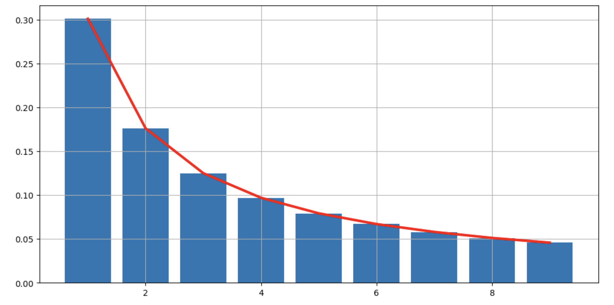
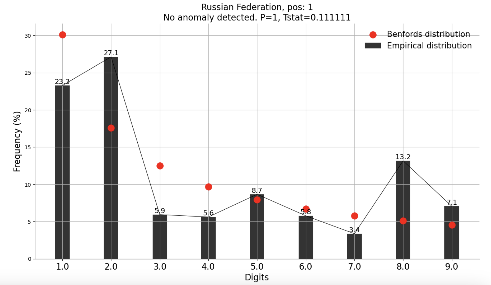

# Benford's Law in World

This repository explores the **Application of Benford's Law** across diverse datasets, driven by academic curiosity to understand how well this law applies to different types of data. **Benford's Law** is often used as a preliminary check for data anomalies, particularly in financial datasets, but in this project, we extend its use to unconventional datasets, including COVID-19 case numbers, to observe its effectiveness and limitations.

---

## 📖 What is Benford's Law?

**Benford's Law** (or the Newcomb–Benford Law) suggests that in many naturally occurring datasets, smaller digits are more likely to appear as the leading digit. According to Benford’s Law:
- The digit **'1'** appears as the leading digit about **30%** of the time.
- The probability decreases as the digits increase, with **'9'** appearing as the leading digit less than **5%** of the time.

This law can be counterintuitive but has been observed across diverse datasets, such as financial records, population numbers, and physical constants. It is valued for revealing inconsistencies, making it useful in forensic accounting and fraud detection.

---

## 📊 Project Structure and Methodology

### 1. **Datasets Analyzed**
   - **[Financial Dataset Analysis]**: Examines a company's financial statement, a traditional application for Benford's Law.
   - **[COVID-19 Case Numbers Analysis]**: Analyzes COVID-19 case numbers as an unconventional dataset, testing Benford’s Law’s applicability to public health data.

### 2. **Analysis Methods**
   - **Python's Benford Library**: Automated computation of Benford distributions.
   - **Manual Computation**: Step-by-step calculation of Benford values for thorough comparison with actual data.

### 3. **Comparison and Visualization**
   - Both analysis methods visualize Benford-distributed expectations vs. actual digit frequencies, revealing how each dataset aligns or deviates from Benford’s Law.

---

## 🔍 Important Notes

This project is purely for academic exploration and does not claim Benford's Law as a definitive tool for verifying data authenticity or accuracy. Deviations from Benford’s Law suggest irregularities but do not confirm inaccuracies or fraud.

---

## 📈 Project Conclusions

### Financial Dataset

In analyzing the company’s financial statements, the results align closely with Benford's Law, reflecting the typical distribution patterns expected. This finding reinforces the law’s application as a preliminary tool for detecting anomalies in financial data.

### COVID-19 Case Numbers

The COVID-19 case numbers show moderate deviation from Benford’s Law, which could be attributed to unique characteristics in pandemic data, such as regional reporting practices and periodic surges. This outcome highlights Benford’s Law’s limitations in certain datasets, especially those influenced by external factors.

Each notebook includes detailed code and visualizations for manual and library-based Benford calculations, allowing easy reproduction or extension of the analysis.

---

## 🧠 Why Explore Benford's Law?
Benford's Law is a fascinating phenomenon in data science and applied mathematics. While commonly used in financial analysis, extending it to other datasets, like COVID-19 case numbers, broadens our understanding of its applicability. This project aims to shed light on Benford’s Law’s effectiveness and inspire further exploration into its limitations and possibilities.
